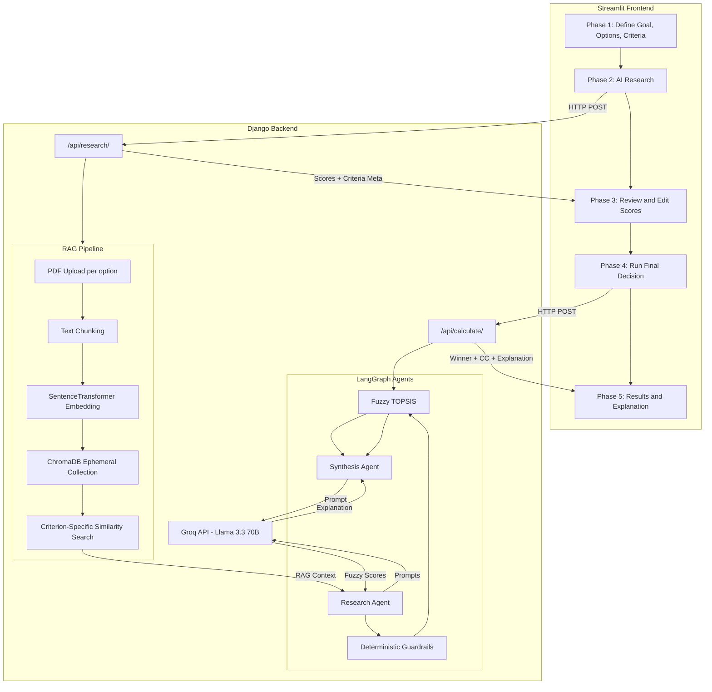

# Design Diagrams

## Architecture Diagram

```mermaid
flowchart TB
    subgraph Frontend["Streamlit Frontend"]
        P1["Phase 1: Define Goal, Options, Criteria"]
        P2["Phase 2: AI Research"]
        P3["Phase 3: Review and Edit Scores"]
        P4["Phase 4: Run Final Decision"]
        P5["Phase 5: Results and Explanation"]
        P1 --> P2 --> P3 --> P4 --> P5
    end

    subgraph Backend["Django Backend"]
        API_R["/api/research/"]
        API_C["/api/calculate/"]

        subgraph RAG["RAG Pipeline"]
            PDF["PDF Upload per option"]
            Chunk["Text Chunking"]
            Embed["SentenceTransformer Embedding"]
            ChromaStore["ChromaDB Ephemeral Collection"]
            Retrieve["Criterion-Specific Similarity Search"]
            PDF --> Chunk --> Embed --> ChromaStore --> Retrieve
        end

        subgraph AgentsBlock["LangGraph Agents"]
            Research["Research Agent"]
            Guard["Deterministic Guardrails"]
            TOPSIS["Fuzzy TOPSIS"]
            Synth["Synthesis Agent"]
            Research --> Guard --> TOPSIS --> Synth
        end

        LLM["Groq API - Llama 3.3 70B"]
    end

    P2 -->|HTTP POST| API_R
    P4 -->|HTTP POST| API_C

    API_R --> RAG
    Retrieve -->|RAG Context| Research
    Research -->|Prompts| LLM
    LLM -->|Fuzzy Scores| Research
    API_R -->|Scores + Criteria Meta| P3

    API_C --> TOPSIS
    TOPSIS --> Synth
    Synth -->|Prompt| LLM
    LLM -->|Explanation| Synth
    API_C -->|Winner + CC + Explanation| P5
```

## Data Flow Diagram

```mermaid
flowchart TD
    subgraph UserInput["User Input"]
        U1["Problem Description"]
        U2["Options with optional PDFs"]
        U3["Criteria with weights"]
    end

    subgraph ResearchReq["Phase 1 - Research Request"]
        API_R["POST /api/research/"]
        Parse["Parse and Validate via Pydantic"]
        ClassifyLLM["Classify Criteria via LLM"]
        U1 --> API_R
        U2 --> API_R
        U3 --> API_R
        API_R --> Parse
        Parse --> ClassifyLLM
    end

    subgraph RAGPipe["Phase 2 - RAG Pipeline"]
        RAG1["PyPDFLoader - extract text"]
        RAG2["RecursiveCharacterTextSplitter"]
        RAG3["SentenceTransformer - 384-dim vectors"]
        RAG4["ChromaDB with option_name metadata"]
        RAG5["Top-K Chunks via similarity search"]
        CTX["RAG Context String"]
        Parse -->|PDFs per option| RAG1
        RAG1 --> RAG2
        RAG2 --> RAG3
        RAG3 --> RAG4
        RAG4 --> RAG5
        RAG5 --> CTX
    end

    subgraph LLMScoring["Phase 3 - LLM Scoring"]
        ANN["Annotate with keyword-match markers"]
        PROMPT["User Prompt with annotated context"]
        SYS["System Prompt - Expert Analyst persona"]
        LLM_CALL["Groq Llama 3.3 70B"]
        RAW["Raw Scores: l, m, u per option x criterion"]
        CTX --> ANN
        ANN --> PROMPT
        SYS --> LLM_CALL
        PROMPT --> LLM_CALL
        LLM_CALL --> RAW
    end

    subgraph Guardrails["Phase 4 - Deterministic Guardrails"]
        GUARD["Keyword Evidence Check"]
        BOOST1["1 term match: floor l=6 m=7 u=8"]
        BOOST2["2+ term matches: floor l=7 m=8 u=9"]
        REWRITE["Rewrite cautious justifications"]
        COMP["Comparative Post-processing"]
        SCORES["Final Research Scores with TFN"]
        RAW --> GUARD
        GUARD --> BOOST1
        GUARD --> BOOST2
        GUARD --> REWRITE
        BOOST1 --> COMP
        BOOST2 --> COMP
        REWRITE --> COMP
        COMP --> SCORES
    end

    subgraph Response["Phase 5 - Response to Frontend"]
        RESP["JSON Response"]
        FE["Streamlit editable score tables"]
        ClassifyLLM --> RESP
        SCORES --> RESP
        RESP --> FE
    end

    subgraph Review["Phase 6 - Human Review"]
        EDITED["Edited Scores + Confirmed Criteria"]
        FE --> EDITED
    end

    subgraph CalcReq["Phase 7 - Calculate Request"]
        API_C["POST /api/calculate/"]
        EDITED --> API_C
    end

    subgraph FuzzyTopsis["Phase 8 - Fuzzy TOPSIS"]
        NORM["1. Normalize Matrix"]
        WEIGHT["2. Apply Criterion Weights"]
        IDEAL["3. Compute FPIS and FNIS"]
        DIST["4. Vertex Distance Calculation"]
        CC["5. Closeness Coefficient"]
        RANKSTEP["6. Rank Options by CC"]
        API_C --> NORM
        NORM --> WEIGHT
        WEIGHT --> IDEAL
        IDEAL --> DIST
        DIST --> CC
        CC --> RANKSTEP
    end

    subgraph Synthesis["Phase 9 - Synthesis"]
        SYNTH_PROMPT["Synthesis Prompt with TOPSIS results"]
        SYNTH_LLM["Groq Llama 3.3 70B"]
        EXPLANATION["Markdown Explanation"]
        RANKSTEP --> SYNTH_PROMPT
        SYNTH_PROMPT --> SYNTH_LLM
        SYNTH_LLM --> EXPLANATION
    end

    subgraph FinalResp["Phase 10 - Final Response"]
        FINAL["JSON: winner, CCs, explanation"]
        RESULTS["Streamlit Results Page"]
        RANKSTEP --> FINAL
        EXPLANATION --> FINAL
        FINAL --> RESULTS
    end
```
